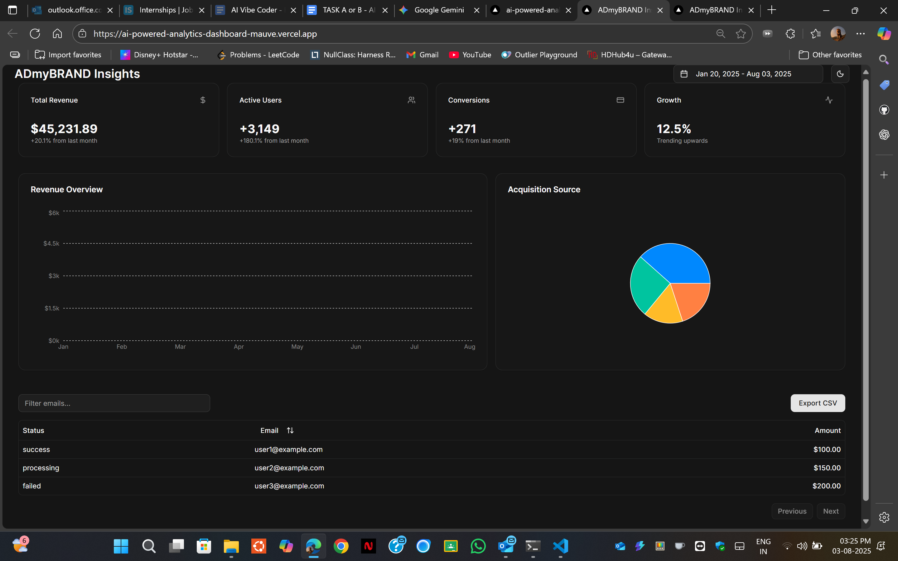

# ADmyBRAND Insights - AI-Powered Analytics Dashboard

A modern, visually stunning analytics dashboard built with Next.js, shadcn/ui, and Recharts. This project showcases a full-featured interface with data visualization, interactive tables, and advanced filtering.



**Live Demo:** [View the Live Demo](https://ai-powered-analytics-dashboard-mauve.vercel.app/)

---

## Features

-   **Dynamic Metric Cards:** At-a-glance view of key metrics like Revenue, Users, and Growth.
-   **Interactive Charts:** Includes line, bar, and pie charts to visualize trends and data breakdowns.
-   **Full-Featured Data Table:** A data table with sorting, filtering by email, and pagination.
-   **Advanced Filtering:** A date range picker to filter dashboard data.
-   **Responsive Design:** Looks great on desktop, tablet, and mobile.
-   **Modern UI/UX:** Built with shadcn/ui, featuring dark/light modes and loading skeletons.
-   **Simulated Real-time Updates:** User metrics card updates periodically to simulate a live data feed.
-   **CSV Export:** Functionality to export table data as a CSV file.

## Tech Stack

-   **Framework:** Next.js 14+ (App Router)
-   **UI:** React, Tailwind CSS, shadcn/ui
-   **Charting:** Recharts
-   **Deployment:** Vercel

## Getting Started

To run this project locally, follow these steps:

1.  **Clone the repository:**
    ```bash
    git clone [https://github.com/YOUR_USERNAME/YOUR_REPOSITORY.git](https://github.com/YOUR_USERNAME/YOUR_REPOSITORY.git)
    cd YOUR_REPOSITORY
    ```
2.  **Install dependencies:**
    ```bash
    npm install
    ```
3.  **Run the development server:**
    ```bash
    npm run dev
    ```
Open [http://localhost:3000](http://localhost:3000) in your browser to see the result.